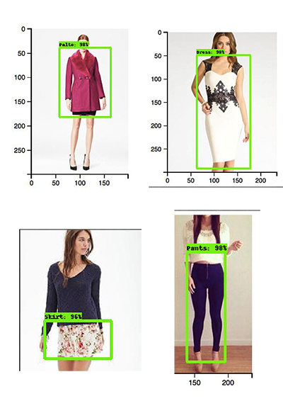

## **Research Interests**
Geometric Deep Learning

## **Education**
Koç University, B.S. in Computer Engineering (2015-2020)
Kabataş Erkek Lisesi, High School (2015)

## **Curriculum Vitae**
<a href="https://github.com/duyguislakoglu/duyguislakoglu.github.io/blob/master/duygu_sezen_islakoglu_cv.pdf">2019</a>

## **Projects**
Object Detection

## **Lecture Notes**
<a href="https://github.com/duyguislakoglu/duyguislakoglu.github.io/blob/master/Math205.pdf">Abstract Algebra</a>

## **Flickr Account** 
<a href="https://www.flickr.com/photos/141791055@N06/albums">See albums</a>

